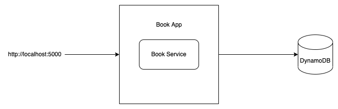

# DynamoDB REST APIs example

>  https://docs.aws.amazon.com/amazondynamodb/latest/developerguide/DynamoDBLocal.DownloadingAndRunning.html
  
### Endpoint

> http://localhost:5000

### Run DynamoDB

>  java -Djava.library.path=./DynamoDBLocal_lib -jar DynamoDBLocal.jar -sharedDb

### Show Tables

>  aws dynamodb list-tables --endpoint-url http://localhost:8000

### Create Table via App

>  http://localhost:5000/createTable

### View Table

> aws dynamodb scan --table-name NameOfTheTableToBeScanned

### Delete Table

>  aws dynamodb delete-table --table-name Book --endpoint-url http://localhost:8000

## Usage

### virtual environment

* python3 -m pip install virtualenv 
* python3 -m virtualenv venv   
* source venv/bin/activate

### run app

* pip install -r requirements.txt
* python app.py

## Architecture

## ER Diagram

### References
* https://aws.amazon.com/dynamodb/
* https://docs.aws.amazon.com/amazondynamodb/latest/developerguide/DynamoDBLocal.DownloadingAndRunning.html
* https://awsclibuilder.com/home/services/dynamodb
* https://boto3.amazonaws.com/v1/documentation/api/latest/guide/quickstart.html
